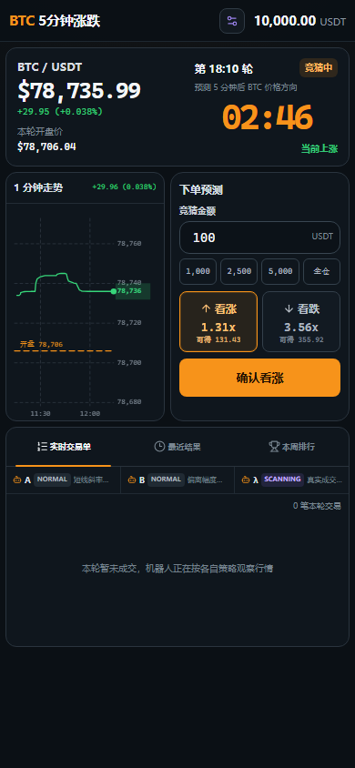

# BitBet · BTC 5 分钟涨跌

BitBet 是一个使用实时 BTC/USDT 行情的 **5 分钟虚拟涨跌预测游戏**。玩家使用模拟 USDT 与 Bot Alpha、Bot Beta、可配置的 Bot Lambda 同场竞猜并参与四人周赛；项目不接触真实资金，也不构成投资建议。

线上地址：[pulse5-btc-sim.zhoushuming.chatgpt.site](https://pulse5-btc-sim.zhoushuming.chatgpt.site/)



## 核心体验

- 5 分钟为一轮，展示当前价、轮次开盘价、方向、状态和倒计时。
- 最近 1 分钟行情图只优化展示层：原始高频 tick 仍供交易、Bot 与结算使用。
- 同一轮可多次下单，可同时持有看涨和看跌订单；每笔订单独立锁定当时价格与赔率。
- 快捷金额按本轮开始余额计算 10% / 25% / 50%，同时受当前可用余额限制；重复值与 0 值会被过滤。
- 最近结果支持领取可领取奖励；余额、订单与领取状态通过同一账本规则计算。
- 手机端使用紧凑的“行情 + 小图 + 下单面板 + Tabs”结构，重点适配 390×844、393×852 与 430×932。

## 三位 Bot

三位 Bot 走独立策略模块，但都通过和真人相同的服务端 `placeOrder`、执行赔率、资金扣减和结算流程下单。

### Bot Alpha — Momentum

- 偏主动和激进，观察短时斜率、涨跌 tick 比、均价位置与动量变化。
- 信号明显时顺势下单，信号不足时 SKIP。
- 状态标签：`HOT`、`NORMAL`、`CAUTIOUS`。
- 短理由示例：`短线动量增强`、`趋势仍然有效`。
- 弱点是可能在趋势末端追涨或追跌。

### Bot Beta — Mean Reversion

- 更克制，关注短期累计涨跌、均值偏离、突然加速与动量衰减。
- 倾向等待冲高/急跌后的减速信号，强单边行情可能直接 SKIP。
- 状态标签：`WAITING`、`NORMAL`、`COOLDOWN`。
- 短理由示例：`价格偏离均值`、`动量开始衰减`。
- 弱点是可能过早猜顶或猜底。

### Bot Lambda — Custom Quant

- 无代码配置 8 类信号：短线涨跌幅、斜率、价格/均线、Tick 多空比、区间位置、波动率、动量变化、区间突破。
- 每个信号可独立启用、选择 15–60 秒窗口并设置 1–5 星权重。
- 将综合信号映射为 `P(UP)` / `P(DOWN)`，再用真实执行赔率计算 Edge；价格冲击破坏 Edge 时会缩小金额或 SKIP。
- 支持固定、置信度、Edge 三种仓位方式，单笔/单轮/单方向敞口上限、市场环境过滤、最多 4 条 AND/OR 附加条件。
- 同轮允许多单和双向订单；只有确实降低最坏情形亏损时才允许自适应对冲。
- 每笔单保存模型概率、执行赔率、Edge、信号分数、对冲标记和短理由，方便回看而不依赖大模型。

### 公平性边界

- 策略上下文只包含决策时已经产生的本轮样本、当前价格、赔率、余额、历史战绩与订单状态。
- 不提供未来 tick、本轮最终 close 或 settlement result。
- Bot 订单进入真实订单账本，不直接改余额，不撤单，也不保证盈利或胜率。
- Bot 不固定在临近结算时下注；它们有独立等待时间、最晚入场时间、冷却与少量随机扰动。

## 周赛与状态提示

排行榜固定统计“你、Bot Alpha、Bot Beta、Bot Lambda”四位，并从真实订单与结算记录计算：

- 本周收益与收益率曲线
- 总资产、胜率、下注次数
- 最大连胜、最大连败、最大回撤
- Bot 实际观察到但未下单的 SKIP 次数
- Lambda 参与轮次、平均每轮订单数、平均 Edge 与对冲次数

连胜、连败或排名变化只在状态首次变化时提示，页面刷新不会重复刷屏。

## 数据持久化说明

当前公开版使用 Sites 身份与服务端 D1 账本，浏览器不再是账户权威来源：

- 同一 ChatGPT 账号在不同浏览器或设备登录后读取同一份玩家、Bot、Lambda 配置和周赛数据。
- 清理缓存、关闭浏览器或使用新设备不会清空服务端账本。
- 玩家下单、实际执行赔率、余额扣减、结算与领取都在服务端完成，客户端只显示结果。
- Worker 提供后台 Bot 定时推进入口；若定时触发或网络短暂中断，下一次运行会按历史 1 秒 K 线逐时点补算最近缺失轮次，并且策略上下文始终只得到该时点以前的数据。

## 技术结构

- React 19 + TypeScript
- Next.js 兼容路由 + Vinext/Vite
- Cloudflare/Sites 部署产物 + D1 持久化
- 领域模块位于 `lib/pulse5/`：行情、轮次、赔率、订单、结算、Bot 与统计彼此分离
- UI 位于 `components/pulse5/`
- Node 原生测试位于 `tests/`

主要目录：

```text
app/                         页面、全局样式与 API 路由
components/pulse5/           行情、下单、Bot、排行榜与移动端 Tabs
lib/pulse5/bots/             Alpha / Beta / Lambda 策略与展示状态
lib/pulse5/server/           账户级权威账本、Bot 调度与断线补算
lib/pulse5/engine/           统一交易引擎与账本视图
lib/pulse5/market/           实时行情与图表展示采样
lib/pulse5/orders/           下单规则
lib/pulse5/settlement/       结算与领取
lib/pulse5/stats/            周赛统计
tests/                       策略、公平性、交易、图表与统计测试
```

## 本地运行

要求 Node.js `>=22.13.0`。

```bash
npm ci
npm run dev
```

默认开发地址为 `http://127.0.0.1:5173/`。

## 验证命令

```bash
npm run lint
npm test
```

`npm test` 会先完成生产构建，再串行运行策略、公平性、订单、赔率、持久化、图表和周赛统计测试。需要真实 CloudBase MySQL 连接的旧兼容层集成测试在未配置连接信息时会跳过。

## 部署

仓库包含 `.openai/hosting.json`，当前生产站点由 OpenAI Sites 托管。发布流程会构建并验证同一 Git commit，打包产物，保存 Site version 后再公开部署。

## 免责声明

本项目仅供交互设计、前端工程和模拟策略研究。所有资金、订单、收益与排行榜均为虚拟数据，不提供真实交易或投资服务。
